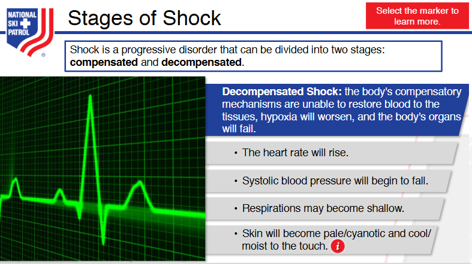
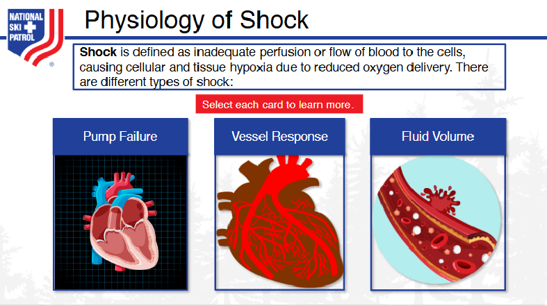
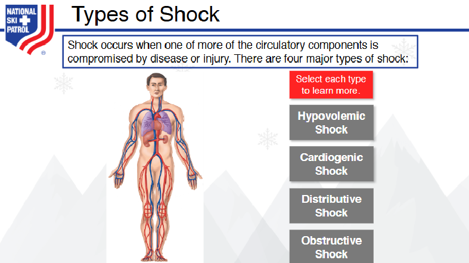

# Nsp Oec Training Chapter 10 - National Ski Patrol - Outdoor Emergency Care chapter 10
National Ski Patrol - Outdoor Emergency Care chapter 10

## Chapter 10: Shock

1. Define shock.
2. Describe three primary causes of shock.
3. Describe how the body compensates for shock.
4. Define the two stages of shock.
5. List the four major types of shock.
6. List the classic signs & symptoms of shock.
7. Describe and demonstrate the management of shock.

## 10.1 Define shock.

**Shock** is a life-threatening medical condition in which the body’s tissues and organs do not receive an adequate supply of **oxygenated blood**, leading to cellular damage and organ failure. Shock can result from various causes, such as severe bleeding, dehydration, heart problems, infections, or trauma. If left untreated, shock can rapidly worsen and become fatal.

### **Types of Shock**:
1. **Hypovolemic Shock**: Caused by a significant loss of blood or fluids (e.g., from trauma or dehydration).
2. **Cardiogenic Shock**: Results from the heart’s inability to pump sufficient blood (e.g., after a heart attack or heart failure).
3. **Distributive Shock**: Caused by abnormal distribution of blood flow, as in **septic shock** (infection), **anaphylactic shock** (severe allergic reaction), or **neurogenic shock** (damage to the nervous system).
4. **Obstructive Shock**: Results from a physical obstruction of blood flow, such as in a **pulmonary embolism** or **tension pneumothorax**.

### **Signs and Symptoms of Shock**:
- Rapid, weak pulse
- Rapid or shallow breathing
- Pale, cool, clammy skin
- Sweating
- Confusion or anxiety
- Dizziness or fainting
- Decreased urine output
- Low blood pressure (late sign)

### **Treatment for Shock**:
- **Lay the person flat** on their back and elevate their legs if there are no suspected spinal injuries (this helps improve blood flow to vital organs).
- **Keep the person warm** to prevent hypothermia.
- **Control bleeding** if present.
- **Administer oxygen** if available, and seek emergency medical care immediately.
- **Reassure and monitor the patient** while waiting for professional medical help.

Early recognition and treatment of shock are essential to prevent severe complications and improve outcomes.

## 10.2 Describe three primary causes of shock.

The **three primary causes of shock** can be classified into the following categories:

### 1. **Hypovolemic Shock**:
   - **Cause**: This type of shock occurs when the body loses a significant amount of **blood or fluids**, resulting in inadequate circulating volume to deliver oxygen and nutrients to tissues and organs.
   - **Examples**: Severe bleeding (hemorrhage) from trauma or surgery, dehydration due to vomiting or diarrhea, or burns that cause fluid loss.
   - **Effect**: The loss of blood or fluids leads to a drop in blood pressure and reduced oxygen delivery to vital organs.

### 2. **Cardiogenic Shock**:
   - **Cause**: This type of shock occurs when the heart is unable to pump enough blood to meet the body's needs, leading to a lack of oxygen supply to organs.
   - **Examples**: Heart attacks (myocardial infarction), heart failure, arrhythmias (irregular heartbeats), or other conditions that impair the heart's ability to function.
   - **Effect**: The weakened heart fails to circulate enough blood, causing a drop in blood pressure and inadequate oxygenation of tissues.

### 3. **Distributive Shock**:
   - **Cause**: This type of shock occurs when blood vessels lose their ability to maintain normal resistance, resulting in **widespread vasodilation** (expansion of blood vessels), which lowers blood pressure and reduces blood flow to vital organs.
   - **Examples**:
     - **Septic shock**: Caused by a severe infection that leads to an overwhelming immune response, triggering widespread vasodilation and inflammation.
     - **Anaphylactic shock**: A severe allergic reaction that causes vasodilation and constriction of the airways.
     - **Neurogenic shock**: Damage to the nervous system (e.g., spinal cord injury) that disrupts normal control of blood vessel tone.
   - **Effect**: Vasodilation results in poor blood distribution, leading to reduced perfusion and oxygen delivery to organs, even though the blood volume may be normal.

These three types of shock (hypovolemic, cardiogenic, and distributive) represent the primary mechanisms by which the body can lose its ability to deliver adequate oxygenated blood to tissues, leading to potentially life-threatening conditions.

## 10.3 Describe how the body compensates for shock.

When the body enters **shock**, it initiates several **compensatory mechanisms** to maintain blood flow to vital organs and prevent further deterioration. These mechanisms are the body’s way of attempting to restore adequate circulation and oxygen delivery. Key compensatory responses include:

### 1. **Increased Heart Rate (Tachycardia)**:
   - The **heart rate increases** to pump more blood in an attempt to maintain adequate cardiac output and blood pressure, ensuring that oxygen reaches vital organs.

### 2. **Vasoconstriction**:
   - The **blood vessels constrict** (narrow), particularly in non-essential areas like the skin and extremities, to redirect blood flow to critical organs such as the brain, heart, and kidneys.

### 3. **Increased Respiratory Rate**:
   - The **respiratory rate increases** to supply more oxygen to the bloodstream and help compensate for the decreased oxygen delivery caused by reduced circulation.

### 4. **Release of Hormones**:
   - The body releases **stress hormones** like **adrenaline (epinephrine)** and **cortisol**, which help increase heart rate, strengthen heart contractions, and promote vasoconstriction.

### 5. **Fluid Retention**:
   - The **kidneys retain water and sodium** by releasing hormones like **antidiuretic hormone (ADH)** and **aldosterone**. This helps maintain blood volume and pressure by reducing fluid loss through urine.

These compensatory mechanisms are temporary and may help stabilize the patient initially, but if the underlying cause of shock is not treated, the body will eventually be unable to maintain these responses, leading to organ failure and death.

## 10.4 Define the two stages of shock.

1. **Compensated Shock**: The early stage of shock where the body’s compensatory mechanisms (e.g., increased heart rate and vasoconstriction) maintain adequate blood pressure and perfusion to vital organs.

2. **Decompensated Shock**: The later stage of shock where the body’s compensatory mechanisms begin to fail, resulting in a drop in blood pressure, poor perfusion, and inadequate oxygen delivery to tissues and organs, leading to life-threatening conditions.

## 10.5 List the four major types of shock.

### **Types of Shock**:
1. **Hypovolemic Shock**: Caused by a significant loss of blood or fluids (e.g., from trauma or dehydration).
2. **Cardiogenic Shock**: Results from the heart’s inability to pump sufficient blood (e.g., after a heart attack or heart failure).
3. **Distributive Shock**: Caused by abnormal distribution of blood flow, as in **septic shock** (infection), **anaphylactic shock** (severe allergic reaction), or **neurogenic shock** (damage to the nervous system).
4. **Obstructive Shock**: Results from a physical obstruction of blood flow, such as in a **pulmonary embolism** or **tension pneumothorax**.

## 10.6 List the classic signs & symptoms of shock.

The **classic signs and symptoms of shock** include:

1. **Rapid, weak pulse** (tachycardia)
2. **Rapid, shallow breathing** (tachypnea)
3. **Cool, clammy, or pale skin**
4. **Sweating**
5. **Weakness or fatigue**
6. **Confusion, anxiety, or restlessness**
7. **Nausea or vomiting**
8. **Dizziness or fainting**
9. **Low blood pressure** (hypotension) – often a late sign
10. **Decreased or no urine output**

These symptoms indicate that the body is not receiving enough oxygenated blood, requiring immediate medical intervention.

## 10.7 Describe and demonstrate the management of shock.

The **management of shock** involves several key steps to stabilize the patient and address the underlying cause:

1. **Ensure an open airway**: Check and maintain a clear airway to ensure proper breathing.
2. **Administer oxygen**: Provide **high-flow oxygen** if available to increase oxygen supply to tissues.
3. **Control bleeding**: If the shock is due to trauma or bleeding, apply **direct pressure** to stop external bleeding.
4. **Position the patient**: Lay the patient **flat on their back** and elevate the legs (if no spinal injury) to improve blood flow to vital organs.
5. **Keep the patient warm**: Cover the patient with a **blanket** to prevent hypothermia, as shock can cause the body to lose heat.
6. **Monitor vital signs**: Regularly check the patient’s pulse, breathing, and mental status while waiting for emergency help.
7. **Provide reassurance**: Keep the patient calm and reassured to reduce stress and anxiety, which can worsen shock.
8. **Call for emergency medical help**: Early intervention is crucial, so call **911** or emergency services immediately.

Early recognition and prompt treatment are critical in managing shock and preventing further deterioration.

## Key Terms 
 1. **Absence Seizure** - A type of seizure involving brief, sudden lapses in attention or consciousness, typically lasting only a few seconds, often without any warning signs. 
  2. **Altered Mental Status** - A broad term describing a change in consciousness, behavior, or cognition, which may range from confusion and disorientation to coma. 
  3. **Coma** - A state of prolonged unconsciousness where a person cannot be awakened, fails to respond to stimuli, and lacks normal wakefulness. 
  4. **Delirium** - An acute, often fluctuating, state of confusion that involves a rapid change in brain function, typically caused by a medical illness or drug intoxication. 
  5. **Dementia** - A group of symptoms associated with a decline in memory, reasoning, or other cognitive functions severe enough to interfere with daily life. 
  6. **Anaphylactic Shock** - A severe, life-threatening allergic reaction that causes airway swelling, breathing difficulties, and a drop in blood pressure. 
  7. **Anticoagulants** - Medications that help prevent blood clots by interfering with the blood's clotting process, commonly referred to as blood thinners. 
  8. **Cardiogenic Shock** - A type of shock caused by the heart's inability to pump enough blood to meet the body's needs, often due to heart attack or heart failure. 
  9. **Distributive Shock** - A form of shock caused by abnormal distribution of blood flow in the smallest blood vessels, often due to sepsis, anaphylaxis, or neurogenic causes. 
  10. **Fainting** - A brief loss of consciousness typically caused by a temporary reduction in blood flow to the brain, also known as syncope. 
  11. **Hypovolemic Shock** - A type of shock caused by severe blood or fluid loss, leading to inadequate circulation and oxygen delivery to the organs. 
  12. **Neurogenic Shock** - A type of distributive shock resulting from a spinal cord injury that disrupts the normal regulation of blood vessel tone, leading to low blood pressure. 
  13. **Obstructive Shock** - A form of shock caused by a physical obstruction to blood flow, such as in pulmonary embolism or cardiac tamponade. 
  14. **Perfusion** - The process of delivering oxygen-rich blood to the tissues and organs throughout the body. 
  15. **Peripheral Vascular Resistance** - The resistance to blood flow in the arteries, which contributes to blood pressure regulation. 
  16. **Pulmonary Embolism** - A blockage in one of the pulmonary arteries in the lungs, usually caused by blood clots that travel from the legs or other parts of the body. 
  17. **Sepsis** - A life-threatening condition caused by the body's extreme response to infection, leading to widespread inflammation and organ dysfunction. 
  18. **Septic Shock** - A severe and potentially fatal condition caused by infection-induced sepsis that leads to dangerously low blood pressure and organ failure. 
  19. **Shock** - A life-threatening condition where blood flow and oxygen supply to tissues and organs are severely reduced, leading to organ failure. 
  20. **Stroke Volume** - The amount of blood pumped by the heart's left ventricle with each beat, a key component in determining cardiac output. 
  21. **Tachycardia** - An abnormally fast heart rate, typically defined as a resting heart rate above 100 beats per minute. 
  22. **Tachypnea** - Abnormally rapid breathing, often a response to low oxygen levels or other medical conditions. 
 

## Getting Started
To get started with the **Nsp Oec Training Chapter 10** solution repository, follow these steps:
1. Clone the repository to your local machine.
2. Install the required dependencies listed at the top of the notebook.
3. Explore the example code provided in the repository and experiment.
4. Run the notebook and make it your own - **EASY !**
    
## Solution Features
- Easy to understand and use  
- Easily Configurable 
- Quickly start your project with pre-built templates
- Its Fast and Automated

## Notebook Features
- **Self Documenting** - Automatically identifes major steps in notebook 
- **Self Testing** - Unit Testing for each function
- **Easily Configurable** - Easily modify with **config.INI** - keyname value pairs
- **Includes Talking Code** - The code explains itself 
- **Self Logging** - Enhanced python standard logging   
- **Self Debugging** - Enhanced python standard debugging
- **Low Code** - or - No Code  - Most solutions are under 50 lines of code
- **Educational** - Includes educational dialogue and background material
    
## Deliverables or Figures
             
    

## Github    
## https://github.com/JoeEberle/ 

## Email 
## josepheberle@outlook.com 

    

    